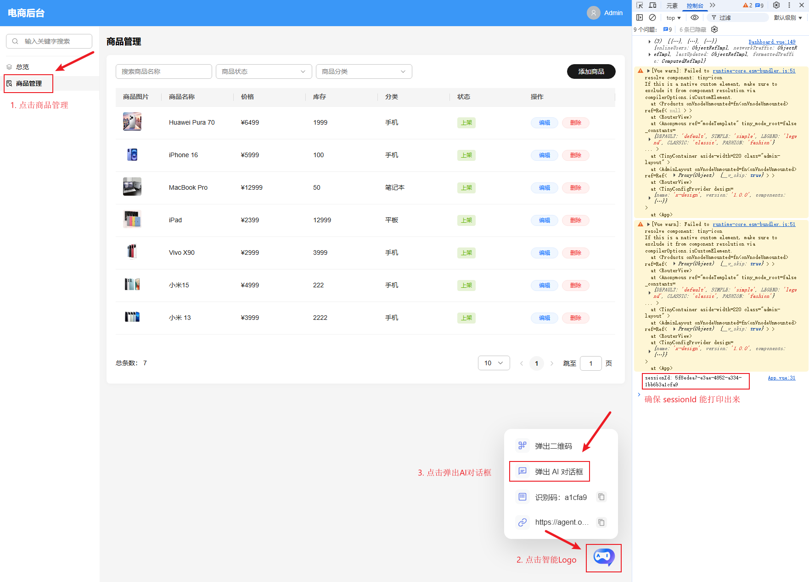
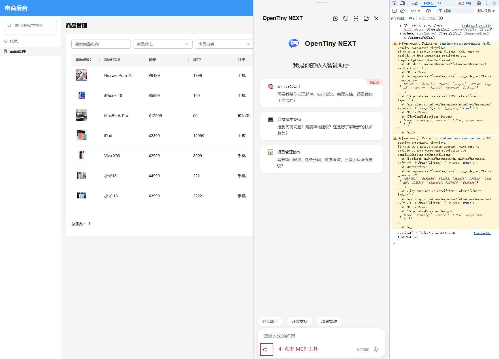
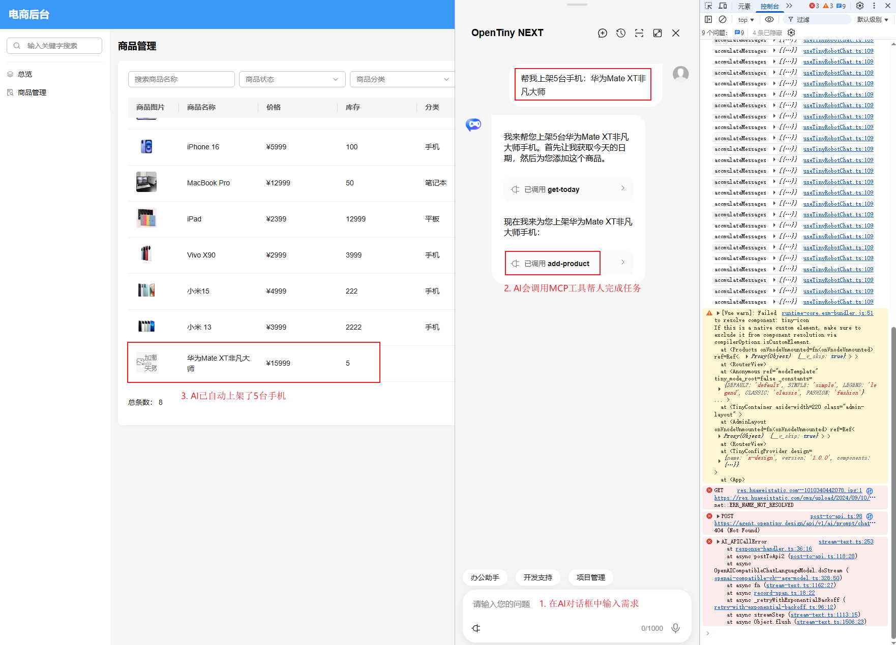

# 电商系统

主要包含：
- shop-admin 电商后台管理系统
- shop-server 电商后端

## 本地启动

```shell
# 安装依赖
pnpm i

# 启动电商后台管理系统
pnpm dev

# 启动电商后端
pnpm dev:server
```

启动之后访问链接：[http://localhost:3060/products](http://localhost:3060/products)

按照以下步骤进行操作：

1. 第一步：先打开 AI 对话框



2. 第二步：点开MCP工具图标，确保MCP工具已成功加载




3. 第三步：通过自然语言描述你的需求，AI将自动帮你完成任务

比如：帮我添加5台手机：华为Mate XT非凡大师


